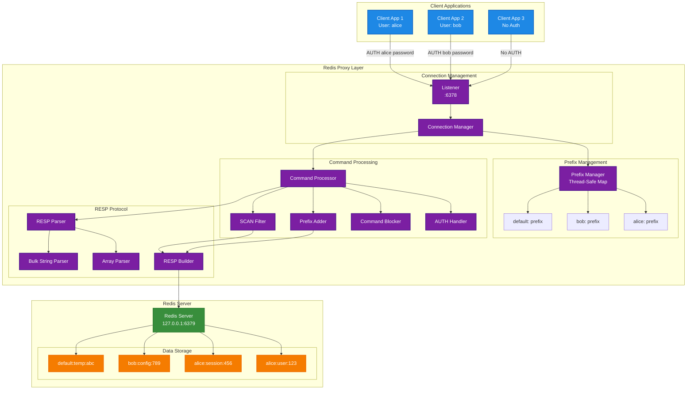
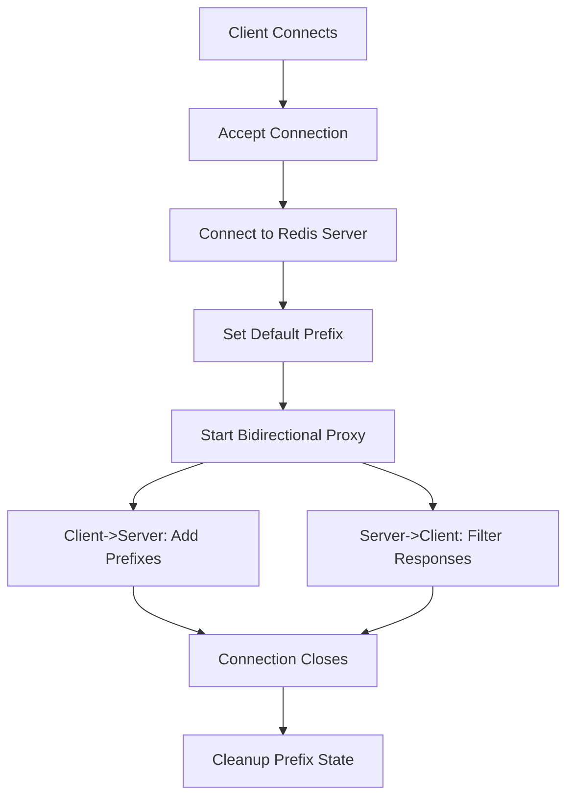
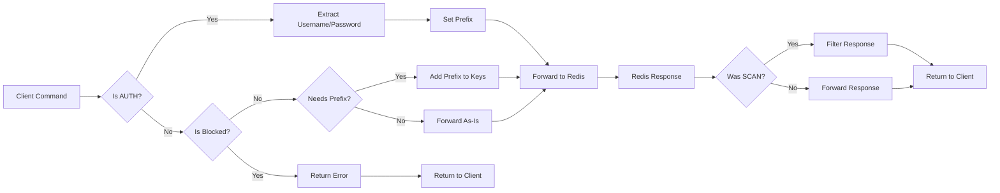
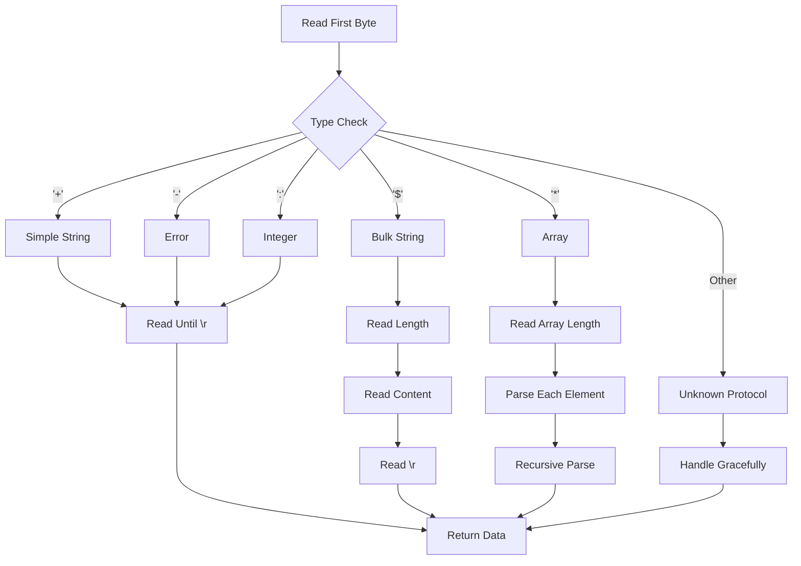
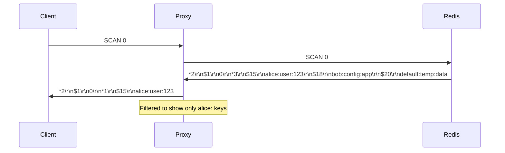

# ReNdang

Redis Multi-tenancy Proxy

## Overview

The Redis Proxy is a sophisticated network proxy that provides automatic key prefixing functionality for Redis operations. It enables multiple applications to share a single Redis instance while maintaining complete data isolation through namespace prefixes. The proxy is transparent to clients and requires no modifications to existing Redis client code.

## System Architecture

### High-Level Architecture



## Core Components

### 1. RedisProxy Struct

The main proxy structure that holds all state and configuration:

```go
type RedisProxy struct {
    proxyAddr     string                    // Listening address
    targetAddr    string                    // Target Redis server
    prefixes      map[net.Conn]string       // Per-connection prefixes
    prefixMux     sync.RWMutex              // Thread-safe prefix access
    defaultPrefix string                    // Default prefix from env
    lastCommand   map[net.Conn]string       // Track last command per connection
    lastCmdMux    sync.RWMutex              // Thread-safe command tracking
}
```

### 2. Connection Management

#### Listener and Accept Loop
- Binds to configurable address (default: `:6378`)
- Accepts incoming client connections
- Spawns goroutine for each connection
- Handles graceful shutdown via signal handling

#### Connection Lifecycle


### 3. Prefix Management

#### Prefix Assignment Strategy
1. **AUTH-based**: Username from AUTH command becomes prefix
2. **Password-based**: Password becomes prefix if no username
3. **Default**: Environment variable `REDIS_DEFAULT_PREFIX`
4. **Auto-generated**: Connection address-based prefix as fallback

#### Thread Safety
- Uses `sync.RWMutex` for concurrent access
- Separate mutexes for prefixes and command tracking
- Automatic cleanup on connection close

### 4. Command Processing Pipeline



## RESP Protocol Implementation

### Protocol Support

The proxy implements a complete Redis Serialization Protocol (RESP) parser:

- **Simple Strings**: `+OK\r\n`
- **Errors**: `-ERR message\r\n`
- **Integers**: `:123\r\n`
- **Bulk Strings**: `$5\r\nHello\r\n`
- **Arrays**: `*2\r\n$3\r\nGET\r\n$4\r\nkey1\r\n`

### Parser Architecture



### Key Prefixing Implementation

#### Command Classification

The proxy maintains comprehensive lists of Redis commands:

**Key Commands** (require prefixing):
- String operations: GET, SET, MSET, MGET, INCR, etc.
- Hash operations: HGET, HSET, HMSET, HMGET, etc.
- List operations: LPUSH, RPUSH, LPOP, RPOP, etc.
- Set operations: SADD, SREM, SMEMBERS, etc.
- Sorted Set operations: ZADD, ZREM, ZRANGE, etc.
- Key operations: DEL, EXISTS, EXPIRE, etc.
- Transaction operations: MULTI, EXEC, WATCH, etc.
- Script operations: EVAL, EVALSHA
- Stream operations: XADD, XREAD, etc.

**Non-Key Commands** (no prefixing):
- AUTH, PING, ECHO, SELECT
- FLUSHDB, FLUSHALL (blocked)
- INFO, CONFIG, CLIENT
- MONITOR, SYNC, PSYNC

#### Prefixing Strategies

1. **Single Key Commands**: Prefix first key argument
   ```
   GET user:123 → GET alice:user:123
   ```

2. **Multiple Key Commands**: Prefix all keys
   ```
   MSET k1 v1 k2 v2 → MSET alice:k1 v1 alice:k2 v2
   ```

3. **Special Commands**: Handle specific patterns
   ```
   EVAL script 2 key1 key2 arg1 → EVAL script 2 alice:key1 alice:key2 arg1
   ```

## Security Features

### Command Blocking

```go
func (p *RedisProxy) isBlockedCommand(data []byte) bool {
    return strings.Contains(string(data), "flush")
}
```

- Blocks FLUSHDB and FLUSHALL commands
- Returns proper Redis error responses
- Prevents accidental data loss

### Authentication Integration

- Extracts username from AUTH commands
- Uses username as namespace prefix
- Falls back to password if no username
- Ensures data isolation even without explicit AUTH

## Response Filtering

### SCAN Command Special Handling

The proxy provides intelligent filtering for SCAN responses:



### Implementation Details

1. **Track Last Command**: Store SCAN commands per connection
2. **Parse Response**: Parse RESP array structure
3. **Filter Keys**: Remove keys without connection prefix
4. **Rebuild Response**: Maintain proper RESP format

## Configuration

### Environment Variables

| Variable | Default | Description |
|----------|---------|-------------|
| `REDIS_PROXY_ADDR` | `:6378` | Proxy listening address |
| `REDIS_DEFAULT_PREFIX` | `lukluk` | Default prefix for connections |

### Runtime Configuration

```go
func main() {
    proxyAddr := getEnv("REDIS_PROXY_ADDR", ":6378")
    targetAddr := "127.0.0.1:6379"
    
    proxy := NewRedisProxy(proxyAddr, targetAddr)
    proxy.Start()
}
```

## Performance Considerations

### Concurrency Model

- **Goroutine per Connection**: Each client connection runs in its own goroutine
- **Thread-Safe State**: Uses mutexes for shared state access
- **Efficient Memory**: Minimal memory overhead per connection

### Memory Management

- **Automatic Cleanup**: Connection state cleaned up on close
- **Buffer Management**: Efficient RESP parsing with minimal allocations
- **Connection Pooling**: No connection pooling (Redis handles this)

### Network Efficiency

- **Bidirectional Streaming**: Concurrent client→server and server→client
- **Minimal Latency**: Direct forwarding with prefix modification
- **Error Handling**: Graceful handling of network issues

## Error Handling

### Network Errors

- Connection failures to Redis server
- Client disconnections
- Malformed RESP data
- Unknown protocol data

### Recovery Strategies

- Automatic connection cleanup
- Graceful degradation
- Comprehensive logging
- Signal-based shutdown

## Monitoring and Logging

### Log Levels

- **Connection Events**: New connections, disconnections
- **Command Processing**: Prefix assignments, blocked commands
- **Error Conditions**: Network errors, parsing failures
- **Debug Information**: RESP parsing details (configurable)

### Metrics (Potential Enhancements)

- Connection count
- Commands processed per second
- Error rates
- Response times

## Deployment Considerations

### Service Management

The proxy includes service management scripts:
- `install-service.sh`: Install as systemd service
- `service-management.sh`: Start/stop/restart service
- `uninstall-service.sh`: Remove service

### Production Deployment

1. **Load Balancing**: Multiple proxy instances behind load balancer
2. **Health Checks**: Monitor proxy health and availability
3. **Configuration Management**: Environment-based configuration
4. **Logging**: Structured logging for production monitoring

## Future Enhancements

### Potential Improvements

1. **Connection Pooling**: Pool connections to Redis server
2. **Metrics Collection**: Prometheus metrics integration
3. **Configuration Hot Reload**: Dynamic configuration updates
4. **TLS Support**: Encrypted connections
5. **Rate Limiting**: Per-prefix rate limiting
6. **Key Expiration**: Automatic prefix cleanup
7. **Cluster Support**: Redis Cluster compatibility

### Scalability Considerations

- **Horizontal Scaling**: Multiple proxy instances
- **Vertical Scaling**: Resource optimization
- **Caching**: Response caching for read-heavy workloads
- **Compression**: RESP compression for large responses

## Testing Strategy

### Test Coverage

- **Unit Tests**: Individual component testing
- **Integration Tests**: End-to-end Redis operations
- **Load Tests**: Concurrent connection testing
- **Protocol Tests**: RESP parsing edge cases

### Test Scripts

- `test_comprehensive.sh`: Full functionality testing
- `test_auth_parsing.sh`: Authentication testing
- `test_enhanced_prefix.sh`: Prefix functionality testing
- `test_pool.sh`: Connection pool testing

## Conclusion

The Redis Proxy provides a robust, scalable solution for Redis multi-tenancy with the following key benefits:

1. **Transparency**: No client code modifications required
2. **Isolation**: Complete data separation through prefixes
3. **Security**: Command blocking and authentication integration
4. **Performance**: Minimal overhead with efficient RESP parsing
5. **Reliability**: Comprehensive error handling and graceful degradation
6. **Maintainability**: Clean architecture with clear separation of concerns

The architecture is designed to be production-ready with proper error handling, logging, and service management capabilities. 
